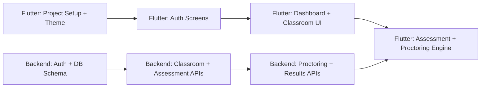

# 🤖 Examify — Multi-Agent Development Guide

This folder contains specialized agent prompts for building **Examify** in parallel using two independent agents.

---

## Agent Roster

| Agent | File | Responsibility |
|-------|------|---------------|
| 🎨 Flutter Frontend | [`flutter_frontend_agent.md`](./flutter_frontend_agent.md) | All Flutter UI, screens, proctoring engine, token refresh |
| ⚙️ Laravel Backend | [`laravel_backend_agent.md`](./laravel_backend_agent.md) | REST API, DB schema, auth, proctoring logic, tests |

---

## How to Run Each Agent

### Option A — Using Antigravity (Recommended)

1. Open a **new Antigravity conversation**
2. Paste the contents of the agent `.md` file as your **first message**, prefixed with:

```
[AGENT PERSONA — READ CAREFULLY BEFORE DOING ANYTHING]
```

Full example for backend agent:
```
[AGENT PERSONA — READ CAREFULLY BEFORE DOING ANYTHING]

# ⚙️ Laravel Backend Agent — Examify
... (paste full contents of laravel_backend_agent.md here)
```

3. Then send your first task instruction, e.g.:
   - *"Start with the database migrations and auth endpoints."*

---

### Option B — Running Both Simultaneously

Open **two Antigravity chats side by side**:

| Chat Window | Agent Prompt | First Instruction |
|-------------|-------------|------------------|
| Left | `laravel_backend_agent.md` | *"Scaffold the Laravel project, run migrations, implement Auth + Classroom APIs first."* |
| Right | `flutter_frontend_agent.md` | *"Scaffold the Flutter project, set up theme, build Login and Register screens first."* |

> **Sync point:** The backend agent should finish Auth + Classroom APIs before the Flutter agent wires up the API calls. Frontend can build UI/screens independently first.

---

## Recommended Build Order



### Phase 1 — Foundation (Parallel ✅)
- **Backend:** Scaffold project → run migrations → implement Auth (register, login, token refresh)
- **Flutter:** Scaffold project → set up theme + colors → build Login + Register screens

### Phase 2 — Core Features (Parallel ✅)
- **Backend:** Classroom, Assessment, Consent, Start, Submit endpoints
- **Flutter:** Teacher/Student dashboards, Classroom detail, Create Assessment screen

### Phase 3 — Proctoring (Backend first ⬅️ then Flutter)
- **Backend:** `POST /proctor-event` with violation threshold + audit trail
- **Flutter:** Connect `ProctoringService`, violation banners, auto-submit nav

### Phase 4 — Results + Polish (Parallel ✅)
- **Backend:** Results + Proctoring Report endpoints, run all tests
- **Flutter:** Result screen, Proctoring Report screen, responsive polish

---

## Shared Contracts

Both agents must agree on:

- **Base URL:** `http://127.0.0.1:8000/api`
- **Auth Header:** `Authorization: Bearer <token>`
- **Date format:** ISO 8601 UTC (`2026-02-23T20:45:00Z`)
- **Proctoring event types:** `alt_tab | app_background | window_blur | fullscreen_exit`
- **Platform values:** `android | ios | windows | macos | web`
- **Violation thresholds:** warn at **3**, auto-submit at **5** (configurable per assessment)

---

## Environment Requirements

| Tool | Version | Check command |
|------|---------|--------------|
| Flutter SDK | ≥ 3.19 | `flutter doctor` |
| Dart | ≥ 3.3 | `dart --version` |
| PHP | ≥ 8.2 | `php -v` |
| Composer | ≥ 2.x | `composer -V` |
| MySQL | ≥ 8.0 | via XAMPP/WAMP/Laragon |
| Laravel | 11 | auto-installed via Composer |
